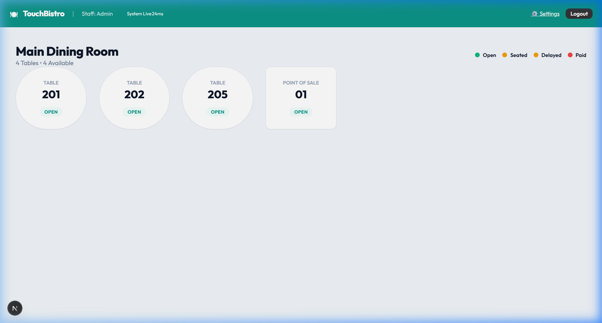
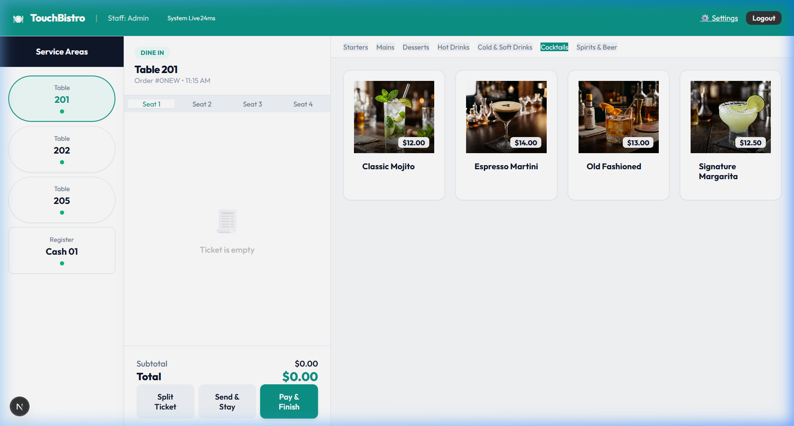
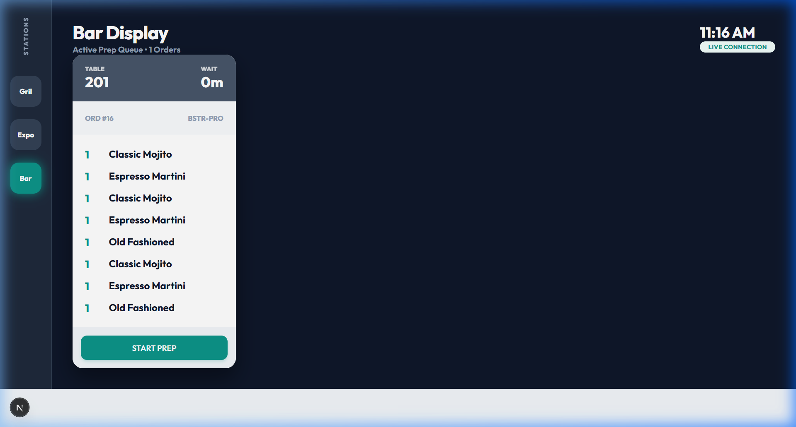
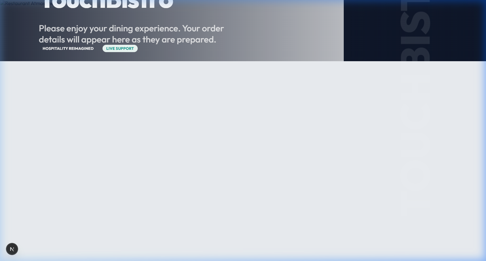

# TouchBistro Clone • Enterprise POS Solution

[**🚀 Launch Live Demo (Localhost Port 3000)**](http://localhost:3000)

[](https://nextjs.org/)
[](https://orm.drizzle.team/)
[](https://www.sqlite.org/)
[](https://developer.mozilla.org/en-US/docs/Web/CSS)

**TouchBistro Clone** is a high-performance, enterprise-grade restaurant management system. This project offers a refined, tablet-first experience that bridges the gap between front-of-house hospitality and back-of-house efficiency.

---

## 📺 Feature Demonstration

*Interactive walkthrough showing Floorplan, Order Entry, KDS, and CFD synchronization.*

---

## 📸 Premium Visual Experience

### 1. Advanced Floorplan Management
A high-contrast, interactive floorplan designed for rapid seating and real-time status tracking.


### 2. High-Fidelity Order Interface
Features artisanal food imagery with studio lighting, 3-pane workflow, and intelligent seat-based order tracking.


### 3. Kitchen Display System (KDS)
Mission-critical display with color-coded priority timers and streamlined 'Bump' capabilities.


### 4. Administrative Dashboard
Comprehensive business analytics, staff management, and an integrated App Marketplace.


### 5. Customer Facing Display (CFD)
Retail-grade Guest experience for order verification, gratuity selection, and digital payments.


---

## 📜 The Build: Demo Script & Technical Narrative

This project was built to mirror the technical complexity and visual polish of the industry-leading TouchBistro POS. Below is the narrative of the architectural journey:

1.  **Phase 1: Foundation & Schema**: Initializing the project with Next.js 15 and Drizzle ORM. We designed a relational schema involving `staff`, `tables`, `orders`, and `menuItems` to support complex state synchronization.
2.  **Phase 2: The "Artisanal" Menu**: Recognizing that high-quality POS systems rely on visual cues, we implemented an artisanal menu system using studio-lit food photography for every item, categorized for rapid server navigation.
3.  **Phase 3: Real-Time Flow**: Developing the three core pillars:
    -   **POS Terminal**: Table management and ticket logic.
    -   **KDS (Kitchen)**: Implementing a priority-based ticket display that updates as servers send orders.
    -   **CFD (Customer)**: A separate view for guests to verify totals and process payments.
4.  **Phase 4: Analytics and Permissions**: Building the Admin suite to track sales performance and manage staff roles with PIN-based authentication.
5.  **Phase 5: Visual Polish**: Leveraging Vanilla CSS for a custom "Teal & Slate" theme, focusing on glassmorphism and micro-animations to ensure a premium look and feel.

---

## 🛠️ Core Technology Stack

- **Frontend**: Next.js 15 (App Router) with high-fidelity Vanilla CSS design system.
- **Database**: Drizzle ORM paired with SQLite for ultra-fast local operations.
- **State Management**: Server-side synchronization for multi-terminal consistency.
- **Design**: "Teal & Slate" Premium Design System with glassmorphism and micro-animations.

## 🚀 Getting Started

1. **Clone the Repository**:
   ```bash
   git clone https://github.com/Alysha93/Touch-Bistro.git
   ```

2. **Install Dependencies**:
   ```bash
   npm install
   ```

3. **Initialize Database**:
   ```bash
   npm run db:push
   cmd /c "npm run seed"
   ```

4. **Launch Dev Server**:
   ```bash
   npm run dev
   ```

---

## 📄 License
This project is licensed under the **MIT License** - see the [LICENSE](./LICENSE) file for details.

---

## 👨‍💻 Developed by Antigravity
*Crafting next-generation enterprise tools for the hospitality sector.*

