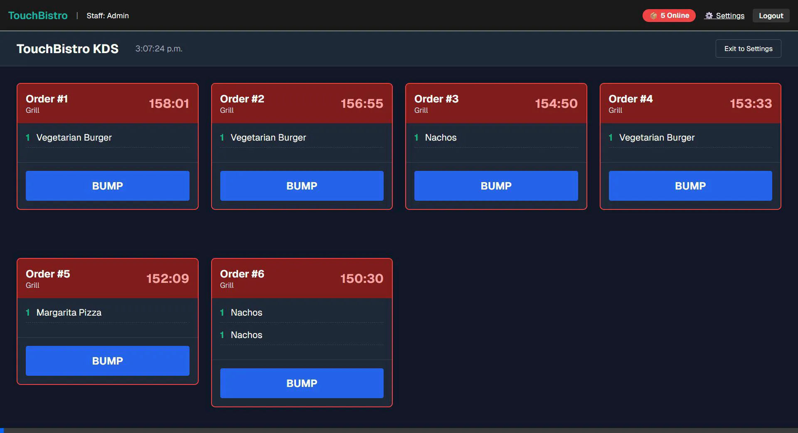
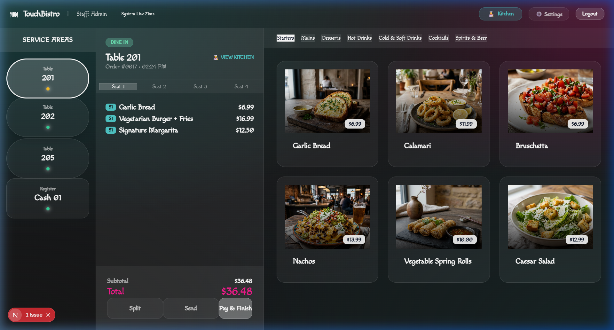
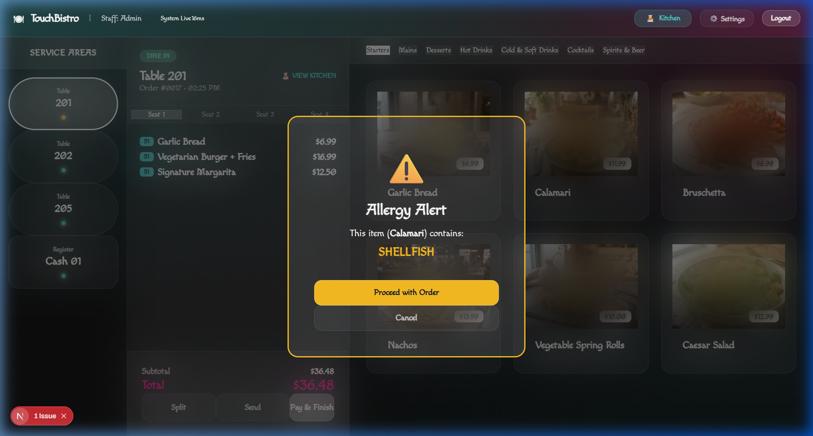
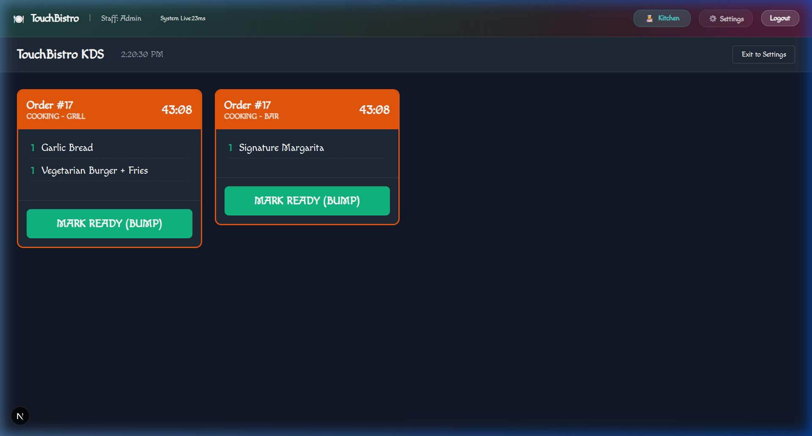
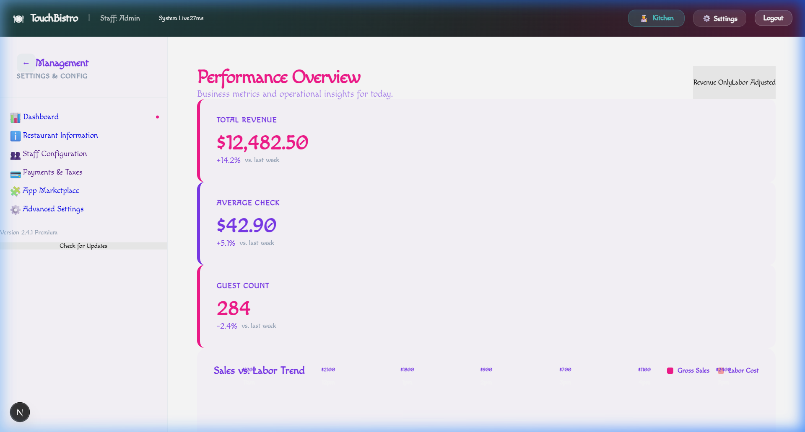
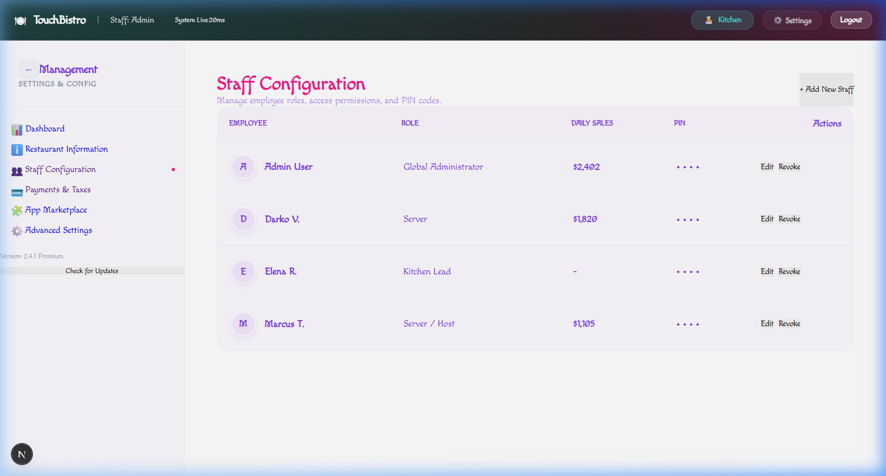
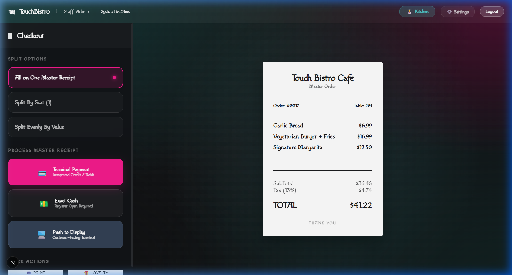

# TouchBistro Clone • Premium Glassmorphism POS

[**🚀 LAUNCH LIVE DEMO (Localhost Port 3000)**](http://localhost:3000)

[](https://nextjs.org/)
[](https://developer.mozilla.org/en-US/docs/Web/CSS/backdrop-filter)
[](https://orm.drizzle.team/)
[](https://www.sqlite.org/)

**TouchBistro Clone** is a high-performance, enterprise-grade restaurant management system. This project features a state-of-the-art **Glassmorphism Design System**, combining vibrant mesh gradients with sophisticated frosted glass interfaces to deliver a premium, tablet-first hospitality experience.

---

## 📺 Workflow Demonstration

*Interactive walkthrough showcasing the Glassmorphism transition and real-time synchronization.*

---

## 📸 Premium Glassmorphism UI Showcase
A curated visual summary of the core ProServe POS modules featuring high-definition captures of the Glassmorphism design system in action.

| Component | Description | Visual Interface |
| :--- | :--- | :--- |
| **🔐 Login Terminal** | Sophisticated entry point featuring frosted glass panels and vibrant Teal/Pink branding. |  |
| **🗺️ Floorplan** | Translucent, high-contrast dining room layout with real-time status indicators and background blur. |  |
| **🍽️ Order Interface** | Multi-pane frosted glass layout with seat-based tracking and artisanal menu photography. |  |
| **⚠️ Safety Alerts** | Integrated high-visibility allergy warnings and menu constraint notifications. |  |
| **👨‍🍳 Kitchen (KDS)** | Mission-critical KDS displaying translucent ticket cards and real-time bump timer tracking. |  |
| **📈 Intelligence** | Management dashboard featuring real-time HSL-tailored sales and labor analytics. |  |
| **👥 Staff Config** | Enterprise-grade staff management suite for role-based permissions and access security. |  |
| **💳 High-Contrast Checkout** | Retail-grade guest checkout using premium mesh gradients for perfect readability. |  |


---

## 🛠️ Technology Stack

- **Frontend**: Next.js 15 (App Router) with Custom Glassmorphism CSS Framework.
- **Database**: Drizzle ORM + SQLite for local performance and persistence.
- **Styling**: Vanilla CSS with HSL-tailored vibrant gradients and frosted glass effects.
- **Animations**: CSS keyframes for fluid, high-end transitions.

---

## 🚀 Installation & Setup

1. **Clone & Install**:
   ```bash
   git clone https://github.com/Alysha93/Touch-Bistro.git
   cd Touch-Bistro
   npm install
   ```

2. **Initialize Database**:
   ```bash
   npm run db:push
   npm run seed
   ```

3. **Launch Terminal**:
   ```bash
   npm run dev
   ```

---

## 📄 License
This project is licensed under the **MIT License**.

---

## 👨‍💻 Developed by Antigravity
*Pushing the boundaries of agentic coding and premium design.*
