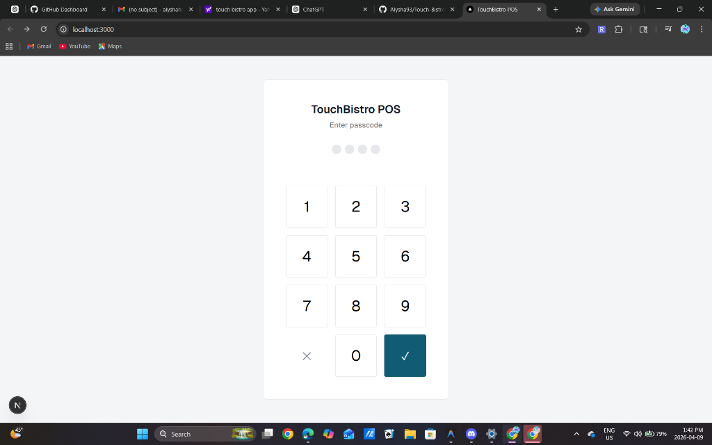
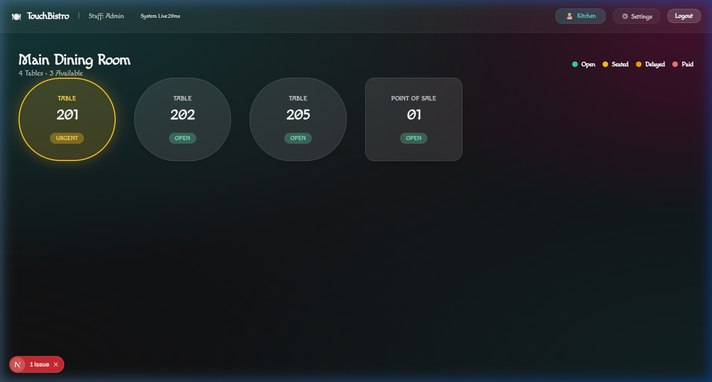
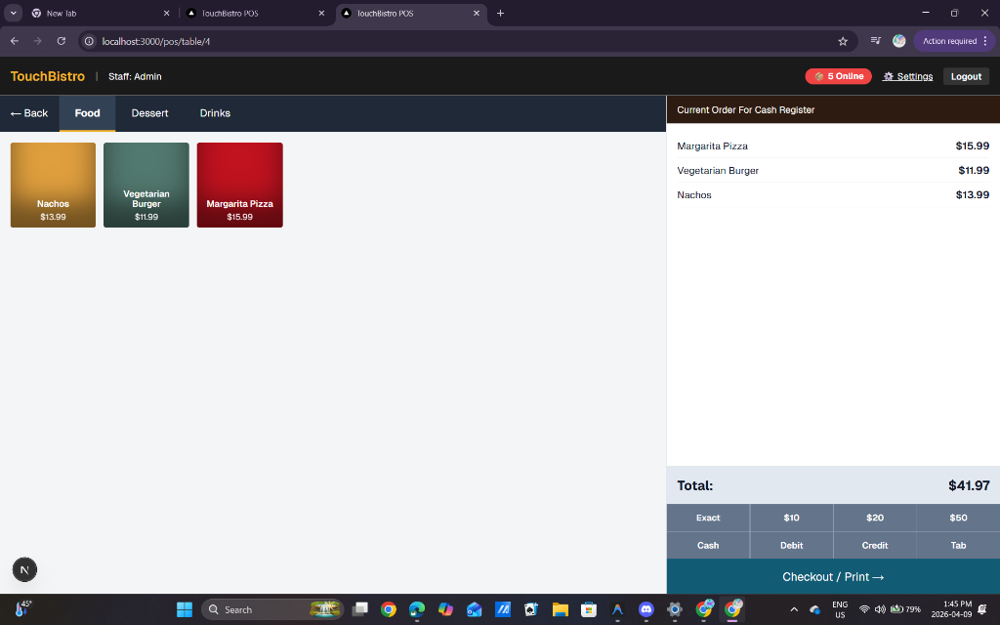
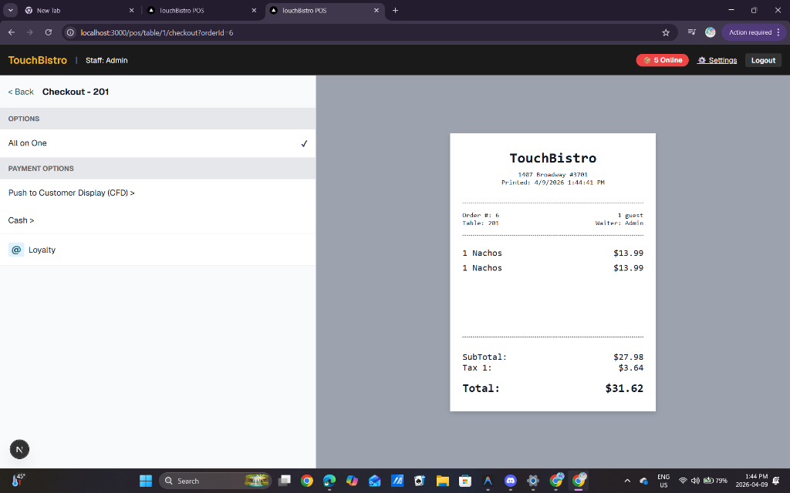
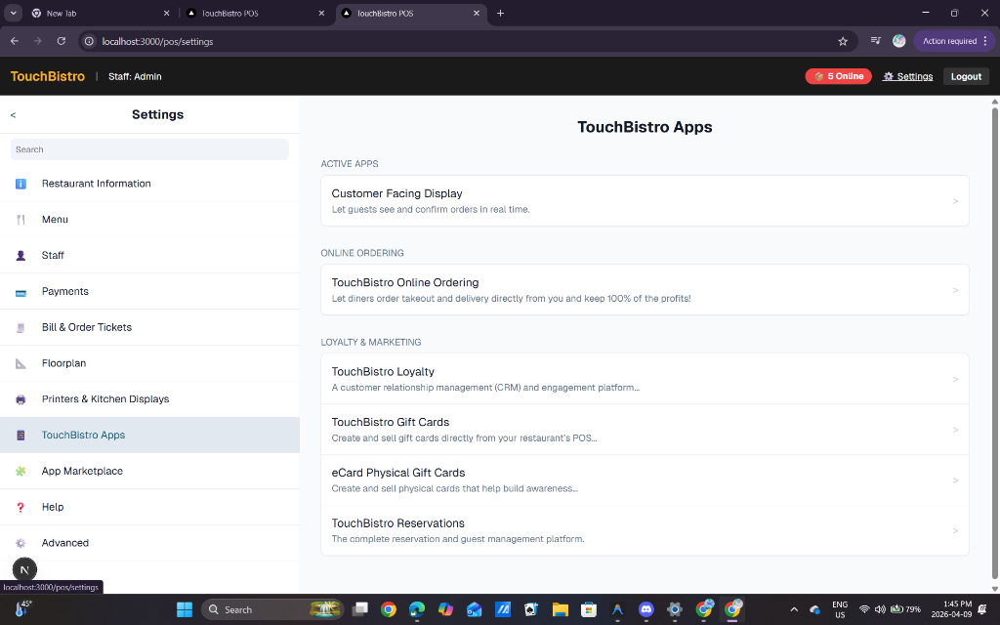

# TouchBistro Clone

A full-stack, tablet-optimized restaurant operating system inspired by TouchBistro, built with Next.js 15 (App Router), Drizzle ORM, and SQLite.

## Modules Included

- **Main Register (`/pos`)**: Staff Login via PIN keypad, interactive Floorplan, complex Table Ordering features (seat grouping, quick-add), and complete receipt Checkout with Loyalty integration.
- **Kitchen Display System (`/kds`)**: Independent back-of-house ticketing interface featuring specialized station filtering (Grill vs Expo), item-level strike-offs, ticket bumping, and elapsed-time visualization.
- **Customer Facing Display (`/cfd`)**: A connected tablet interface designed to face the customer that syncs to active Register checkouts in real-time, prompting for on-screen Tips and Signatures.
- **Online Takeout Web App (`/online`)**: A distinct customer-facing menu portal supporting shopping carts and Loyalty point retrieval. Web orders bypass the floorplan entirely, alerting the local POS register via a live badge and injecting the tickets straight into the Kitchen Display queue.

## Demo Video

> *Note: If GitHub says "generating video" or the preview is blank, please click the direct hyperlink below!*

### [▶️ Click Here to View Full Authentic System Demo](https://raw.githubusercontent.com/Alysha93/Touch-Bistro/main/public/demo.webp)

## Screenshots

### Staff Login

### Floorplan View

### Active Table Order

### Print Receipt & Checkout

### Store Settings & Apps

## Setup

1. `npm install`
2. `npx drizzle-kit push` (to synchronize the SQLite schema)
3. `npm run seed` (to populate Staff PINs, menu items, and prep stations)
4. `npm run dev`

## Schema

The database is built using SQLite and Drizzle ORM. The core schema includes:
- **`prep_stations`**: Kitchen stations (e.g., Grill, Expo).
- **`staff`**: Staff members with roles and secure PINs.
- **`tables`**: Restaurant tables with statuses (`open`, `seated`, `paid`).
- **`menu_categories` & `menu_items`**: Menu catalog with pricing and prep station assignments.
- **`orders` & `order_items`**: Active and past orders, linking tables, staff, and individual item status.
- **`kds_tickets`**: Kitchen Display System tickets for tracking prep times.
- **`loyalty_accounts`**: Customer loyalty tracking via phone number.
- **`menu_modifiers`**: Customizations for menu items.
- **`timeclocks`**: Staff clock-in/out tracking.
- **`reservations`**: Customer table reservations.

## License

This project is licensed under the [MIT License](LICENSE).
