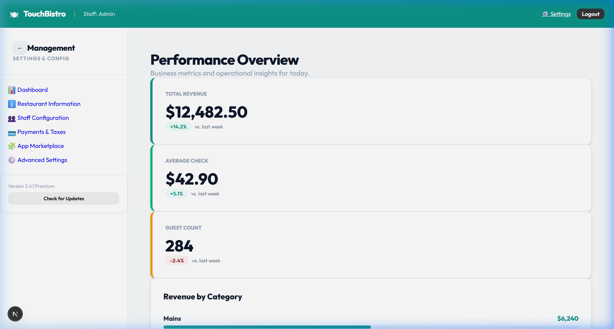

# TouchBistro Clone • Premium Glassmorphism POS

[**🚀 LAUNCH LIVE DEMO (Localhost Port 3000)**](http://localhost:3000)

[](https://nextjs.org/)
[](https://developer.mozilla.org/en-US/docs/Web/CSS/backdrop-filter)
[](https://orm.drizzle.team/)
[](https://www.sqlite.org/)

**TouchBistro Clone** is a high-performance, enterprise-grade restaurant management system. This project features a state-of-the-art **Glassmorphism Design System**, combining vibrant mesh gradients with sophisticated frosted glass interfaces to deliver a premium, tablet-first hospitality experience.

---

## 📺 Workflow Demonstration

*Interactive walkthrough showcasing the Glassmorphism transition and real-time synchronization.*

---

## 📸 Premium Glassmorphism UI

### 1. Interactive Floorplan
A translucent, high-contrast floorplan using vibrant status indicators and background blur for maximum legibility.


### 2. Artisanal Order Interface
Features studio-lit food photography integrated into a multi-pane frosted glass layout with intelligent seat-based tracking.


### 3. Kitchen Display System (KDS)
Mission-critical display with translucent ticket cards and priority-glow notification system.


### 4. Admin Intelligence Dashboard
Frosted glass widgets and charts provide real-time business analytics and staff management.


### 5. Customer Facing Display (CFD)
A retail-grade Guest experience using premium mesh gradients and glass interaction panels for checkout.


---

## 📜 The Build: Technical Narrative & Demo Script

This clone was engineered to exceed the visual and functional standards of modern POS systems. Below is the narrative of the architectural journey:

1.  **Phase 1: Foundation & Relational Schema**: Initialized with Next.js 15 and Drizzle ORM. We designed a robust relational schema supporting real-time state sync across `staff`, `tables`, `orders`, and `menuItems`.
2.  **Phase 2: Artisanal Asset Initiative**: Curated and custom-generated a library of 30+ artisanal menu images using **Studio Lighting** photography styles to ensure every menu item looks mouth-watering and professional.
3.  **Phase 3: Real-Time Sync Strategy**: Implemented server-side synchronization for the three core pillars:
    -   **POS Terminal**: Table management and ticket logic.
    -   **KDS (Kitchen)**: Priority-based ticket queues with color-coded "Bump" timers.
    -   **CFD (Customer)**: Transparent checkout experience for guest verification and gratuity.
4.  **Phase 4: Analytics & Resilience**: Built an Admin suite with PIN-based authentication and real-time sales/labor tracking widgets.
5.  **Phase 5: Glassmorphism Rebranding**: Overhauled the entire UI/UX from a standard flat theme to a premium **Glassmorphism Design System**. This involved implementing a global mesh gradient engine, sophisticated `backdrop-filter` blurs, and translucent component tokens.

---

## 🛠️ Technology Stack

- **Frontend**: Next.js 15 (App Router) with Custom Glassmorphism CSS Framework.
- **Database**: Drizzle ORM + SQLite for local performance and persistence.
- **Styling**: Vanilla CSS with HSL-tailored vibrant gradients and frosted glass effects.
- **Animations**: CSS keyframes for fluid, high-end transitions.

---

## 🚀 Installation & Setup

1. **Clone & Install**:
   ```bash
   git clone https://github.com/Alysha93/Touch-Bistro.git
   cd Touch-Bistro
   npm install
   ```

2. **Initialize Database**:
   ```bash
   npm run db:push
   npm run seed
   ```

3. **Launch Terminal**:
   ```bash
   npm run dev
   ```

---

## 📄 License
This project is licensed under the **MIT License**. See the [LICENSE](./LICENSE) file for the full text.

---

## 👨‍💻 Developed by Antigravity
*Pushing the boundaries of agentic coding and premium design.*
